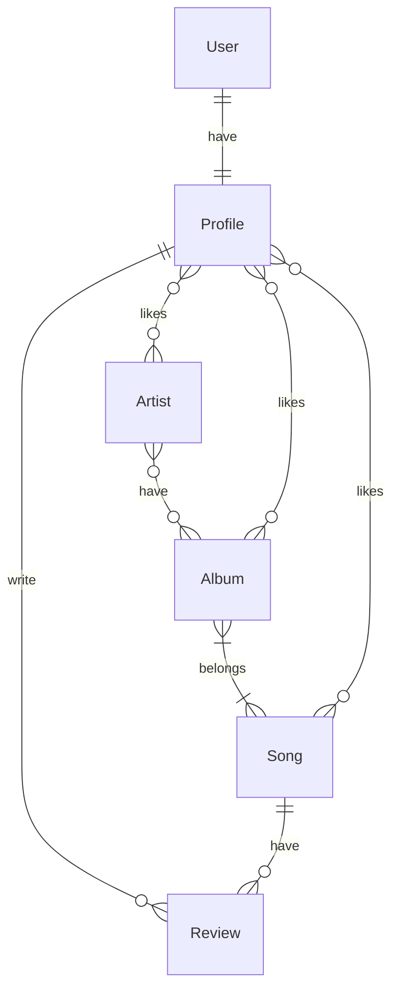
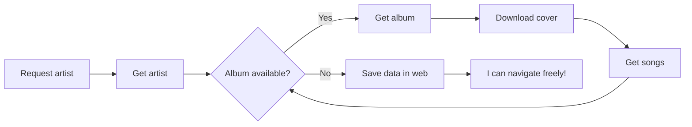
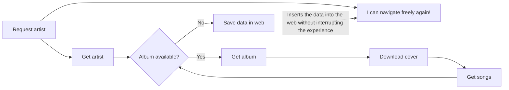

---
hide:
  - navigation
---

# 🚀 **Getting started**

## 🔐 **User Authentication**

In our application, user deletion, creation, and modification are managed through Django’s admin interface (as long as you have administrator credentials) and the various tools it provides, such as the `createsuperuser` management command, which allows the creation of admin users in the system. Additionally, for development needs, we have created a small custom management command called `createfakeusers`, which allows the creation of one or several users with their corresponding application profiles, assigning fake data for future testing purposes.

```py
class Command(BaseCommand):
    help = 'Sign up profiles with given usernames.'

    def add_arguments(self, parser):
        parser.add_argument('usernames', nargs='+', help='List of usernames to create profiles for')
        
    def handle(self, *args, **kwargs):
        usernames = kwargs['usernames']
        for username in usernames:
            email = f"{username}@example.com"
            try:
                user = User.objects.create_user(username=username, email=email, password='1234')
                profile = Profile.objects.create(user=user) 
                self.stdout.write(self.style.SUCCESS(f'Successfully created profile for {username} with id {profile.id}'))
            except Exception as e:
                self.stdout.write(self.style.ERROR(f'Error creating profile for {username}: {e}'))
```

## 🗂️ **Data Model**

The decision to work with the MusicBrainz API and learning about it helped us reach a final design for the data model: we adapted the design to make full use of the MusicBrainz API effortlessly and achieve automation of the work, something fundamental that is covered later in the documentation.



The social network nature explains the number of relationships the `Profile` model has within the Jukabox ecosystem.

## 🧱 **Code Structure**

### 🛠️ Backend

On this side of our API, different *apps* were created to segment the various models, views, and serializers used in Jukabox:

1. **Accounts**: Handles user login, registration, and logout, as well as the `createfakeusers` management command found in this *app*.
2. **Albums**: Handles album management.
3. **Artists**: Handles artist management.
4. **Songs**: Handles song and *review* management.
5. **Users**: Handles profile and *likes* management.
6. **Importer**: Handles data importing and external links.
7. **Shared**: Common aspects of the application, such as the site search bar.

Some *apps* share functional similarities; for example, apps like *Artists*, *Albums*, or *Songs* contain various views that return quick results for different sections of the website.

```py
@check_method('GET')
def most_liked_songs(request: HttpRequest) -> JsonResponse:
    songs = Song.objects.all().order_by('-likes')[:6]
    serializer = SongSerializer(songs, request=request)
    return serializer.json_response()
```

An example is the view above, which returns the six most liked songs.

Then we have other views with slightly more complex functionality, like the following:

```py
@check_method('POST')
@check_json_body
@assert_body_fields('artist_mbid')
@assert_token
def import_artist(request: HttpRequest) -> JsonResponse:
    mbid = request.data['artist_mbid']
    mbid_pattern = r'^[0-9a-f]{8}-[0-9a-f]{4}-[0-9a-f]{4}-[0-9a-f]{4}-[0-9a-f]{12}$'
    if not (m := re.fullmatch(mbid_pattern, mbid)):
        return JsonResponse({'error': 'Invalid MBID'}, status=400)
    import_artist_data.delay(mbid)
    if Artist.objects.get(mbid=mbid):
        return JsonResponse({'message': f'Updating artist data...'})
    return JsonResponse({'message': f'Adding artist data...'})
```

This is the main view of the *Importer*, where you can see the use of different decorators (for more efficient code), regex pattern matching, and error handling using guard clauses.

### 🎨 Frontend

The *frontend* is a *Single Page Application* by nature, easily achieved with Vue's technology as a framework, both due to the use of its libraries `vue-router` and Pinia, and the flexibility offered by its *Single File Components* (SFC): special format files that allow encapsulating logic, style, and the structure of components or web elements.

On the other hand, the structure we follow on the *frontend* is focused on the principle of *"Feature-based Organization"*, meaning that the files are organized and separated based on the feature they work on—something similar to how *Django* apps are structured. With that in mind, the elements we have are:

1. **Components**: The various elements available on our website, classified according to functionality.

   * **Layout**: Common sections of the website such as the *Header* or *Footer*
   * **Elements**: Components used in views or other specific components.
   * **Elements/shared**: Common components across the website.
   * **Classes**: Implemented Typescript interfaces.
2. **Composables**: Reusable code structures; in our case, `useAPI.ts`, which contains all necessary functions to make API requests to Django, and `useSocial.ts`, which, although similar, is more focused on user actions such as giving *likes* or sending a *review*.
3. **Locales**: Language files.
4. **Router**: Where the code that manages URLs and the site's navigation system is located.
5. **SCSS**: SCSS files with common elements like colors used throughout the website.
6. **Stores**: Where the Pinia *stores* are located; in our case, `useAuthStore`, which manages user authentication.
7. **Views**: And finally, the views or *RouterView*, essential for the website’s functionality and its nature as a *Single Page Application* (SPA).


## 💻 **Technologies and Tools**

**Development Environments and Tools:**

* **Visual Studio Code** as the main editor, with extensions such as Django, Prettier, Error Lens, and custom snippets that improved efficiency.
* **Git** for version control.
* **SQLite** as the database management system, used by default by the Django framework.

**Languages:**
**Python**, **SQL**, and **TypeScript** were used as programming languages. For the structure and design of the web interface, **HTML**, **CSS**, and **SCSS** were used as markup and style languages.

**Frameworks:**
The main frameworks used were **Django** for backend development, **Vue.js** for the frontend, and **Bootstrap** for responsive and aesthetic interface design.

**Libraries:**
Notable libraries include:

* **django-rq**, for executing background tasks (such as image processing or email sending).
* **vue-toast-notifications**, to display popup notifications to users.
* **vue-i18n**, which facilitates the internationalization of the application.
* **Pinia**, as the global state management system in Vue.

**Complementary Technologies:**
**Redis** was used as a queue system to efficiently execute asynchronous tasks via django-rq.

### 📤 The Importer as a Decoupled Task

As I mentioned before, the **Importer** is one of the core applications and pillars of Jukabox. It is responsible for importing data from the MusicBrainz API and managing existing external links. This rather extensive function makes multiple requests to the MusicBrainz API, including downloading *covers* for albums (if available). It is a time-consuming process, and the more content the artist to be added has, the longer the user will have to wait from when the import process starts until it finishes before they can continue using the application.



To solve this, we decided to design this function as a decoupled task: by leveraging services like Redis and the Django-RQ library, we can separate the user from this waiting time and run the entire search and download process in the background, allowing the user to navigate freely while all the work is being done.




## 🎨 **Design Decisions**

### ⚙️ Technology Justification

* **Django:** Chosen for being a robust and scalable framework that facilitates rapid development of secure web applications thanks to its architecture based on the MTV pattern (Model-Template-View) and its DRY (Don’t Repeat Yourself) philosophy.
* **Pillow:** Allows efficient image manipulation, essential for features like resizing, format conversion, or dynamic image generation.
* **IPython:** An interactive tool ideal for debugging and quick testing of Python functions during development.
* **django-rq:** Manages background tasks using Redis Queue, improving system efficiency by offloading costly operations like image processing or bulk email sending.
* **Vue.js:** Chosen for being a progressive, lightweight, and flexible framework that enables building reactive user interfaces with a component-based architecture. It facilitates modular and scalable web development.
* **Pinia:** Selected as Vue.js's official state management system for its simplicity, native integration with the Composition API, and TypeScript compatibility. It improves global state organization and traceability during development.
* **vue-toast-notifications:** Used to display clear, non-intrusive toast notifications, providing immediate feedback to users for actions like successful operations or errors.
* **ESLint:** Implemented as a code analysis tool to enforce good coding practices, detect potential issues, and maintain a clean, consistent code style throughout the project.
* **Bootstrap:** Included as a CSS design framework to streamline the creation of responsive and visually consistent interfaces, reducing development time with its grid system and reusable components.
* **vue-i18n:** Adopted for application internationalization, enabling dynamic and straightforward content adaptation to multiple languages, improving accessibility for users from different linguistic backgrounds.

### 🧩 Approach and Pattern Justification

* **Component-based architecture:** Modularizing the application into reusable components and independent Django apps enhances scalability, maintainability, and team collaboration by isolating specific functionalities.
* **Modularity through apps:** Dividing the project into independent apps allows for more organized and scalable development, simplifying maintenance and collaboration.
* **Background task management:** Using django-rq offloads intensive processes (like image processing or mass emailing) from the main execution flow, improving system efficiency and user experience.
* **Resource optimization and efficient handling:** Use of Pillow for image processing and compression reduces frontend load and improves performance.
* **Component-based architecture:** Vue.js structures the interface into reusable and encapsulated components that support application scalability and maintainability.
* **Centralized state management with Pinia:** Enables predictable and reactive control of global state, improving code organization and simplifying debugging.
* **Internationalization with vue-i18n:** Implements a pattern to separate texts from logic, facilitating translation and multilingual support without affecting structure.
* **Popup notifications with vue-toast-notifications:** Enhances user experience by providing immediate and non-intrusive feedback for key actions.
* **Responsive design with Bootstrap:** Ensures the interface adapts properly to various devices, guaranteeing accessibility and usability.
